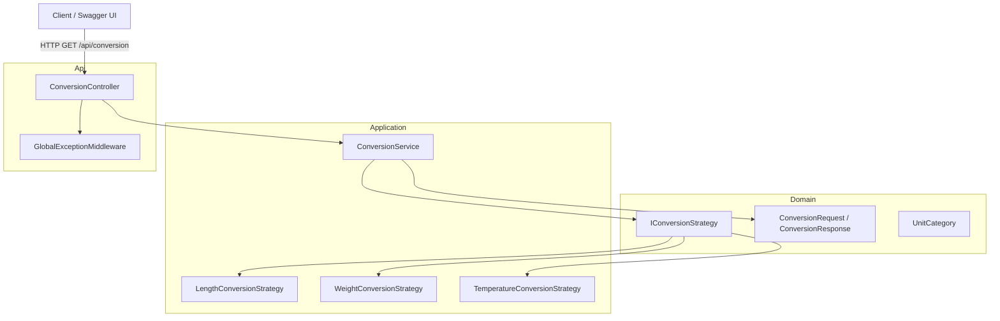

# Unit Conversion API

A clean, extensible ASP.NET Core Web API for converting values between common units of measurement (Length, Weight/Mass, and Temperature).

This project is intentionally scoped to be **simple, professional, and easy to discuss in a Junior Software Engineer interview**, while still demonstrating solid software engineering fundamentals: separation of concerns, the Strategy Pattern, dependency injection, validation, global exception handling, and automated testing.

---

## 1. Project Overview

The Unit Conversion API exposes a single endpoint that converts a numeric value from one unit to another (e.g. `10 meter -> foot`, `25 celsius -> fahrenheit`, `100 kilogram -> pound`).

It supports three categories of units out of the box:

- **Length**: meter, kilometer, centimeter, inch, foot, yard, mile
- **Weight / Mass**: gram, kilogram, pound, ounce
- **Temperature**: celsius, fahrenheit, kelvin

The system is designed so that adding new units or entirely new categories (e.g. Volume, Speed) requires **adding new code, not modifying existing code** — a direct application of the Open/Closed Principle.

---

## 2. Features

- Convert values between units within the same category (Length, Weight, Temperature)
- Reject conversions between incompatible categories (e.g. Kilogram → Celsius) with a clear error message
- Validation for missing parameters, invalid units, invalid numeric values, and same-unit conversions
- Consistent JSON response envelope for both success and error cases
- Global exception handling middleware for unhandled errors
- Swagger / OpenAPI documentation with XML comments
- Full unit and integration test suite using xUnit and FluentAssertions

---

## 3. Architecture Overview

The solution follows a simple **Clean Architecture**-inspired layering:

- **Domain** — Core business models and abstractions. No dependencies on other layers.
- **Application** — Business logic: conversion strategies and the conversion service. Depends only on Domain.
- **Api** — ASP.NET Core Web API layer: controllers, DTOs, middleware, and startup configuration. Depends on Application and Domain.
- **Tests** — xUnit test project covering strategies, the service layer, and the API endpoints.

### Architecture Diagram



---

## 4. Project Structure

```
UnitConversion/
├── UnitConversion.sln
├── README.md
├── src/
│   ├── UnitConversion.Domain/
│   │   ├── Enums/
│   │   │   └── UnitCategory.cs
│   │   ├── Models/
│   │   │   ├── ConversionRequest.cs
│   │   │   └── ConversionResponse.cs
│   │   ├── Interfaces/
│   │   │   └── IConversionStrategy.cs
│   │   └── UnitConversion.Domain.csproj
│   │
│   ├── UnitConversion.Application/
│   │   ├── Interfaces/
│   │   │   └── IConversionService.cs
│   │   ├── Services/
│   │   │   └── ConversionService.cs
│   │   ├── Strategies/
│   │   │   ├── LengthConversionStrategy.cs
│   │   │   ├── WeightConversionStrategy.cs
│   │   │   └── TemperatureConversionStrategy.cs
│   │   ├── Exceptions/
│   │   │   ├── ConversionExceptions.cs
│   │   │   └── ConversionValidationException.cs
│   │   └── UnitConversion.Application.csproj
│   │
│   └── UnitConversion.Api/
│       ├── Controllers/
│       │   └── ConversionController.cs
│       ├── Middleware/
│       │   └── GlobalExceptionMiddleware.cs
│       ├── DTOs/
│       │   ├── ConversionRequestDto.cs
│       │   └── ConversionResponseDto.cs
│       ├── Properties/
│       │   └── launchSettings.json
│       ├── appsettings.json
│       ├── appsettings.Development.json
│       ├── Program.cs
│       └── UnitConversion.Api.csproj
│
└── tests/
    └── UnitConversion.Tests/
        ├── Strategies/
        │   ├── LengthConversionStrategyTests.cs
        │   ├── WeightConversionStrategyTests.cs
        │   └── TemperatureConversionStrategyTests.cs
        ├── Services/
        │   └── ConversionServiceTests.cs
        ├── Controllers/
        │   └── ConversionControllerTests.cs
        └── UnitConversion.Tests.csproj
```

---

## 5. Design Decisions

### Why the Strategy Pattern was chosen

Each unit category (Length, Weight, Temperature) has its own conversion rules:

- Length and Weight conversions are simple multiplicative factors against a base unit.
- Temperature conversions require offset-based formulas (e.g. `C * 9/5 + 32`), not just multiplication.

Rather than writing one large method with `switch` statements or nested `if/else` chains to handle every unit combination, each category is encapsulated in its own class implementing `IConversionStrategy`. The `ConversionService` simply asks each registered strategy "can you handle this conversion?" and delegates to the first one that can.

This keeps each strategy:

- **Focused** — only knows about its own category's units and formulas
- **Testable** — can be unit tested in complete isolation
- **Independently extensible** — changes to Weight conversions can never break Length conversions

### How the solution supports future expansion (Open/Closed Principle)

The `ConversionService` depends only on the `IConversionStrategy` abstraction and an injected collection of strategies (`IEnumerable<IConversionStrategy>`). It has **no knowledge of specific units or categories**.

To support a new category or new units:

1. Add new unit names and conversion factors to an existing strategy's dictionary (e.g. add "stone" to `WeightConversionStrategy`), **or**
2. Create a brand-new strategy class for a new category.

In both cases, `ConversionService`, the controller, and the middleware remain **completely unchanged**.

### How to add a new conversion category (e.g. Volume)

1. Add a new value to the `UnitCategory` enum in `UnitConversion.Domain/Enums/UnitCategory.cs` (e.g. `Volume`).
2. Create a new class `VolumeConversionStrategy` in `UnitConversion.Application/Strategies/` that implements `IConversionStrategy`:
   - Set `Category => UnitCategory.Volume`
   - Define a dictionary of unit-to-base-unit conversion factors (e.g. liters)
   - Implement `CanConvert` and `Convert`
3. Register the new strategy in `Program.cs`:
   ```csharp
   builder.Services.AddScoped<IConversionStrategy, VolumeConversionStrategy>();
   ```
4. Add unit tests for the new strategy following the existing pattern.

No existing controller, service, or middleware code needs to change.

### Other decisions

- **No database** — units and conversion factors are well-known constants and are hardcoded in each strategy, avoiding unnecessary infrastructure.
- **No authentication, Docker, or external infrastructure** — kept out of scope per requirements to keep the project focused and interview-friendly.
- **Consistent response envelope** (`ApiResponse<T>`) — every response (success or failure) has the same `success` / `data` / `message` shape, making the API predictable for consumers.
- **Global exception middleware** — guarantees that even unexpected (unhandled) errors return a consistent JSON shape with HTTP 500, instead of leaking stack traces.
- **Nullable reference types & file-scoped namespaces** — modern C# practices for null-safety and concise code.

---

## 6. Running Locally

Requirements: [.NET 8 SDK](https://dotnet.microsoft.com/download/dotnet/8.0)

```bash
# Restore dependencies
dotnet restore

# Build the solution
dotnet build

# Run the API (from the repository root)
dotnet run --project src/UnitConversion.Api/UnitConversion.Api.csproj
```

By default, the API will be available at `http://localhost:5080` (and `https://localhost:7080` if using the `https` launch profile), and will open the Swagger UI automatically in Development mode.

---

## 7. Running Tests

```bash
dotnet test
```

This runs all unit tests (for strategies and the conversion service) and integration tests (for the API endpoint), using **xUnit** and **FluentAssertions**.

---

## 8. Swagger Usage

When running in the `Development` environment, Swagger UI is available at:

```
/swagger
```

It provides interactive documentation for the `GET /api/conversion` endpoint, including parameter descriptions (sourced from XML doc comments) and example responses.

---

## 9. Sample Requests and Responses

### Successful conversion — Length

**Request:**
```
GET /api/conversion?value=10&from=meter&to=foot
```

**Response (200 OK):**
```json
{
  "success": true,
  "data": {
    "originalValue": 10,
    "fromUnit": "meter",
    "toUnit": "foot",
    "convertedValue": 32.8084,
    "category": "Length"
  },
  "message": null
}
```

### Successful conversion — Temperature

**Request:**
```
GET /api/conversion?value=25&from=celsius&to=fahrenheit
```

**Response (200 OK):**
```json
{
  "success": true,
  "data": {
    "originalValue": 25,
    "fromUnit": "celsius",
    "toUnit": "fahrenheit",
    "convertedValue": 77,
    "category": "Temperature"
  },
  "message": null
}
```

### Successful conversion — Weight

**Request:**
```
GET /api/conversion?value=10&from=kilogram&to=pound
```

**Response (200 OK):**
```json
{
  "success": true,
  "data": {
    "originalValue": 10,
    "fromUnit": "kilogram",
    "toUnit": "pound",
    "convertedValue": 22.046226,
    "category": "Weight"
  },
  "message": null
}
```

### Invalid unit

**Request:**
```
GET /api/conversion?value=10&from=banana&to=foot
```

**Response (400 Bad Request):**
```json
{
  "success": false,
  "data": null,
  "message": "Unit 'banana' is not recognized."
}
```

### Unsupported conversion (incompatible categories)

**Request:**
```
GET /api/conversion?value=10&from=kilogram&to=celsius
```

**Response (400 Bad Request):**
```json
{
  "success": false,
  "data": null,
  "message": "Cannot convert from 'kilogram' to 'celsius' because they belong to different unit categories."
}
```

### Missing parameters

**Request:**
```
GET /api/conversion?from=meter&to=foot
```

**Response (400 Bad Request):**
```json
{
  "success": false,
  "data": null,
  "message": "Query parameter 'value' is required and must be a valid number."
}
```

### Same-unit conversion

**Request:**
```
GET /api/conversion?value=10&from=meter&to=meter
```

**Response (400 Bad Request):**
```json
{
  "success": false,
  "data": null,
  "message": "Source and target units must be different."
}
```

---

## 10. Future Improvements

- Add additional categories (Volume, Speed, Area, Data Storage, etc.) following the existing Strategy Pattern.
- Move unit definitions and conversion factors into configuration files for non-developer maintainability.
- Add response caching for frequently requested conversions.
- Add request/response logging middleware for observability.
- Support batch conversion requests (multiple conversions in a single call).
- Add API versioning to support backward-compatible evolution of the endpoint.
