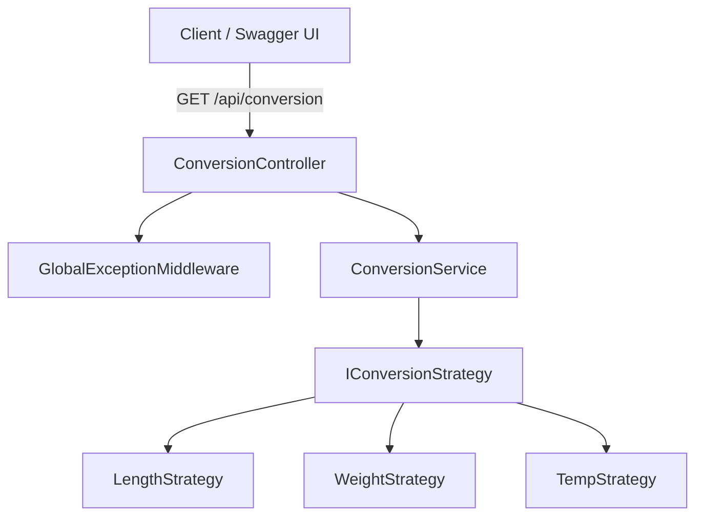

# Unit Conversion API

A small ASP.NET Core Web API for converting between common units of length, weight, and temperature.

## What it does

One endpoint. Give it a value, a "from" unit, and a "to" unit, and it returns the converted value.

```
GET /api/conversion?value=10&from=meter&to=foot
```

Supported units:

- **Length**: meter, kilometer, centimeter, inch, foot, yard, mile
- **Weight**: gram, kilogram, pound, ounce
- **Temperature**: celsius, fahrenheit, kelvin

Converting across categories (e.g. kilogram → celsius) returns a 400 with an explanation instead of garbage output.

## Project structure

```
UnitConversion/
├── UnitConversion.sln
├── src/
│   ├── UnitConversion.Domain/
│   │   ├── Enums/UnitCategory.cs
│   │   ├── Models/ConversionRequest.cs, ConversionResponse.cs
│   │   └── Interfaces/IConversionStrategy.cs
│   ├── UnitConversion.Application/
│   │   ├── Interfaces/IConversionService.cs
│   │   ├── Services/ConversionService.cs
│   │   ├── Strategies/LengthConversionStrategy.cs, WeightConversionStrategy.cs, TemperatureConversionStrategy.cs
│   │   └── Exceptions/
│   └── UnitConversion.Api/
│       ├── Controllers/ConversionController.cs
│       ├── Middleware/GlobalExceptionMiddleware.cs
│       ├── DTOs/
│       └── Program.cs
└── tests/
    └── UnitConversion.Tests/
        ├── Strategies/
        ├── Services/
        └── Controllers/
```



## Why Strategy Pattern

Length and weight conversions are just a multiplication against a base unit. Temperature needs offset formulas (`C * 9/5 + 32`), so it can't share that math.

Each category gets its own class implementing `IConversionStrategy`. `ConversionService` loops through the registered strategies and uses whichever one says it can handle the requested units. No switch statements, and adding a category doesn't touch the existing ones.

## Adding a new category (e.g. Volume)

1. Add `Volume` to `UnitCategory` enum.
2. Create `VolumeConversionStrategy` implementing `IConversionStrategy` with a unit-to-base-unit dictionary.
3. Register it in `Program.cs`:
   ```csharp
   builder.Services.AddScoped<IConversionStrategy, VolumeConversionStrategy>();
   ```
4. Add tests following the existing pattern.

`ConversionService`, the controller, and the middleware don't change.

## Running it

Requires .NET 8 SDK.

```bash
dotnet restore
dotnet build
dotnet run --project src/UnitConversion.Api/UnitConversion.Api.csproj
```

Runs on `http://localhost:5080`. Swagger UI at `/swagger`.

## Tests

```bash
dotnet test
```

## Sample responses

**Length conversion**
```
GET /api/conversion?value=10&from=meter&to=foot
```
```json
{
  "success": true,
  "data": {
    "originalValue": 10,
    "fromUnit": "meter",
    "toUnit": "foot",
    "convertedValue": 32.8084,
    "category": "Length"
  },
  "message": null
}
```

**Unknown unit**
```
GET /api/conversion?value=10&from=banana&to=foot
```
```json
{
  "success": false,
  "data": null,
  "message": "Unit 'banana' is not recognized."
}
```

**Mismatched categories**
```
GET /api/conversion?value=10&from=kilogram&to=celsius
```
```json
{
  "success": false,
  "data": null,
  "message": "Cannot convert from 'kilogram' to 'celsius' because they belong to different unit categories."
}
```

**Missing parameters**
```
GET /api/conversion?from=meter&to=foot
```
```json
{
  "success": false,
  "data": null,
  "message": "Query parameter 'value' is required and must be a valid number."
}
```

## Possible improvements

- More categories (volume, speed, area)
- Move conversion factors to config
- Batch conversion requests
